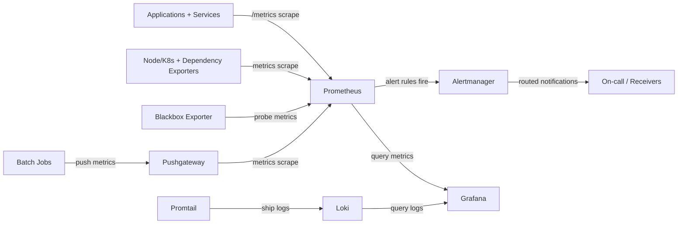

# Monitoring System Overview

This document explains how the monitoring components in this repo fit together and how they help during an outage.

## Monitoring Stack Diagram



## Components and Their Roles

1. **Prometheus (metrics collection + alert evaluation)**
   - Scrapes metrics from Services annotated with `prometheus.io/*`.
   - Collects node and Kubernetes state metrics (node-exporter, kube-state-metrics).
   - Evaluates alert rules and sends alerts to Alertmanager.
   - Config: `k8s/helm-values/monitoring/prometheus-values.yaml`

2. **Alertmanager (alert routing)**
   - Receives alerts from Prometheus.
   - Groups and routes alerts by severity, namespace, and service.
   - Config scaffold exists for routing.
   - Config: `k8s/helm-values/monitoring/prometheus-values.yaml`

3. **Grafana (dashboards + alert visibility)**
   - Shows dashboards, alert lists, and alert annotations.
   - Dashboards are provisioned as code so they are versioned.
   - Config: `k8s/helm-values/monitoring/grafana-values.yaml`

4. **Loki + Promtail (logs)**
   - Promtail collects container logs and ships them to Loki.
   - Grafana queries Loki to correlate logs with alerts/metrics.
   - Configs: `k8s/helm-values/monitoring/loki-values.yaml`, `k8s/helm-values/monitoring/promtail-values.yaml`

5. **Exporters (dependencies visibility)**
   - Postgres, Redis, RabbitMQ exporters provide dependency metrics.
   - Configs: `k8s/helm-values/monitoring/*-exporter-values.yaml`

6. **Blackbox Exporter (endpoint probes)**
   - Performs HTTP probes to validate real reachability.
   - Helps detect DNS/routing issues that internal metrics might miss.
   - Config: `k8s/helm-values/monitoring/blackbox-exporter-values.yaml`

7. **Pushgateway (short-lived jobs)**
   - Allows batch jobs (migrations, backups, timeout handlers) to push metrics.
   - Scraped by Prometheus as a static target.
   - Config: `k8s/helm-values/monitoring/prometheus-values.yaml`

## How It All Fits Together

1. **Applications + Infra emit metrics** through annotated Services or exporters.
2. **Prometheus scrapes metrics** and stores time series.
3. **Recording rules** precompute SLI/SLO metrics for consistent alerts and dashboards.
4. **Alerting rules** fire on availability, latency, stability, saturation, and infrastructure issues.
5. **Alertmanager** routes alerts to the right receiver.
6. **Grafana** displays dashboards, active alerts, and alert annotations.
7. **Loki logs** provide root-cause evidence when alerts fire.

## Downtime Scenario: API Gateway Failure

**Situation:** The API Gateway becomes unhealthy due to a bad deployment.

### Step 1: Alert Fires
- `PayflowHighErrorRateCritical` triggers because 5xx rate exceeds 5% for 5 minutes.
- `PayflowHighLatencyP95` may also fire if latency spikes.

### Step 2: Alert Visibility
- Alert is listed in Grafana under **Active Alerts (Filtered)**.
- An alert annotation appears on charts at the exact failure time.

### Step 3: Scope the Blast Radius
In Grafana:
- Filter `Service = api-gateway` to see service-specific charts.
- Check error rate and latency graphs to confirm the impact window.
- Verify whether other services are healthy.

### Step 4: Root Cause from Logs
Use Grafana Loki:
- Open the logs panel for `api-gateway`.
- Look at the time range around the alert annotation.
- Identify exceptions, timeout messages, or upstream failures.

### Step 5: Mitigation
Possible actions:
- Roll back the deployment.
- Scale replicas if capacity is the issue.
- Adjust CPU/memory limits if throttling or OOM is detected.

### Step 6: Post-Incident Validation
After the fix:
- Alerts resolve in Alertmanager and Grafana.
- Error and latency graphs return to baseline.
- Log volume and error signatures drop.

## Why This Helps During Downtime

- **Fast detection:** Alerts fire when users are affected.
- **Quick scoping:** Per-service alerts isolate the failing component.
- **Deep diagnosis:** Logs and metrics together reveal root cause.
- **Consistent signals:** Recording rules ensure dashboards and alerts agree.

## Downtime Troubleshooting Playbook (Runbook)

Use this when users report outages or major slowness.

### Scenario: Transaction Requests Stuck in `PENDING`

**Symptoms**
- Users can submit transfers, but completion is delayed or never happens.
- You see `PENDING` growth in transaction metrics.

**Likely causes**
- Transaction worker backlog or consumer failure.
- RabbitMQ issues (queue depth rising, consumer disconnected).
- Wallet-service dependency failures causing retries.

### Step-by-Step Troubleshooting

1. **Confirm user impact in Grafana**
- Open **Application Performance**:
  - `Request Rate by Service`
  - `Error Rate by Service (%)`
  - `Latency p95 by Service (seconds)`
- Check **Alerts** row:
  - `Firing Alerts`
  - `Firing Alerts by Name`
- Check **Active Alerts (Filtered)** for:
  - `PayflowHighErrorRateCritical`
  - `PayflowHighLatencyP95`
  - `PayflowReplicaMismatch`

2. **Check deployment health (desired vs actual)**
- Open **Cluster Health**:
  - `Replica Gap`
  - `Desired vs Available Replicas by Deployment`
- If `Replica Gap > 0`, treat as rollout/runtime degradation first.

3. **Check saturation and throttling**
- Open **Resource Utilization**:
  - `CPU Throttling by Pod (%)`
  - `CPU Usage as % of Limits by Pod`
  - `Memory Usage as % of Limits by Pod`
- If throttling or memory pressure is high, scale or adjust limits before deeper app debugging.

4. **Validate queue and worker behavior**
- In transaction metrics/log panels, confirm backlog trend.
- Check for retry/dead-letter symptoms in logs.
- Use runtime checks:
```bash
kubectl get pods -n payflow
kubectl logs -n payflow deploy/transaction-service --tail=200
kubectl logs -n payflow deploy/notification-service --tail=200
```

5. **Correlate logs with alert timestamps**
- In **Namespace Logs (Loki)**:
  - Filter around alert start time.
  - Look for connection errors, timeout errors, or dependency failures (`wallet-service`, `rabbitmq`, `postgres`, `redis`).

6. **Mitigate based on findings**
- Bad rollout: rollback deployment.
- Under-provisioned pods: scale replicas.
- CPU throttling: increase CPU limits/requests.
- Queue backlog: restore consumers, then scale worker replicas.
- Dependency outage: recover dependency first, then validate service recovery.

7. **Recovery validation**
- `Replica Gap` returns to `0`.
- Error and latency panels normalize.
- Alert count drops to zero/pending clears.
- Queue backlog trends down and `PENDING` transaction growth stops.

### Escalation Decision Rules

1. **Escalate to platform/infrastructure** when:
- Node CPU/memory pressure is high across services.
- Multiple unrelated services fail simultaneously.

2. **Escalate to service owners** when:
- One service shows isolated 5xx/latency increase.
- Logs show service-specific regressions after deploy.

3. **Escalate to data/dependency owners** when:
- Postgres/Redis/RabbitMQ connectivity errors dominate logs.

### Post-Incident Checklist

1. Record exact start/end timestamps and impacted services.
2. Capture primary alert(s) and first confirming metric panel.
3. Document root cause category: deploy, capacity, dependency, or platform.
4. Add or tune alerts if detection lagged.
5. Add a prevention task (capacity, rollout safety, or dependency hardening).
